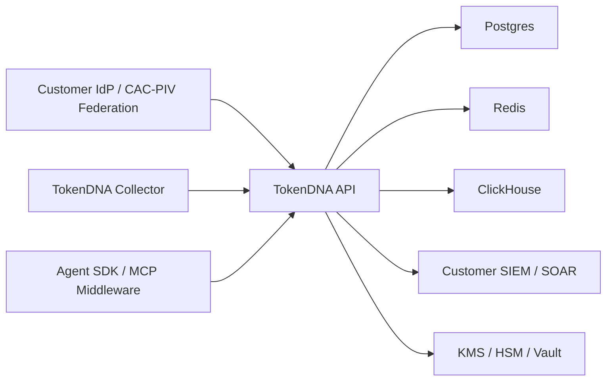

# System Security Plan Starter

## System Identification

| Field | Value |
|-------|-------|
| System name | TokenDNA AI Agent Identity Control Plane |
| Deployment model | Customer-local appliance, Helm deployment, or customer-managed enclave |
| Target profiles | `cmmc_l2`, `fedramp_high`, `dod_il4`, `dod_il5`, `dod_il6` |
| Authorization boundary | TokenDNA API/control plane, collector, SDK integrations, Postgres, Redis, ClickHouse, audit export, and operational deployment automation |

## Authorization Boundary

TokenDNA is intended to run inside a customer-controlled boundary. The product
stores agent identity evidence, tenant configuration, API-key metadata, trust
authority state, behavioral profiles, policy decisions, and audit records.
Customer identity providers, SIEM/SOAR systems, key managers, network
perimeters, backups, object-lock storage, and enclave security services are
outside the product boundary unless explicitly bundled in a customer deployment.



## Data Types

| Data class | Examples | Protection expectation |
|------------|----------|------------------------|
| Tenant identity | tenant id, tenant name, API key prefix, roles | RBAC, audit, encrypted storage inherited from database/enclave |
| Agent identity evidence | attestations, certificates, trust graph, workflow receipts | Integrity protected, signed, auditable |
| Behavioral telemetry | session risk, policy decisions, MCP tool evidence | Tenant scoped, minimized, auditable |
| Security audit | admin actions, revocations, config changes, startup events | Hash-chained, HMAC protected, SIEM exported |
| Secrets | HMAC keys, attestation signing material, database credentials | Customer KMS/HSM/Vault; never stored in source or DB |

## Required Production Posture

DoD-oriented deployments must run `scripts/preflight_prod.py` with a compliance
profile:

```bash
TOKENDNA_COMPLIANCE_PROFILE=dod_il5 \
python scripts/preflight_prod.py --environment il5
```

The DoD profiles require:

- `DEV_MODE=false`
- `TOKENDNA_ENV=production`
- explicit OIDC tenant claim mapping
- `TOKENDNA_OIDC_ALLOW_SUB_TENANT_FALLBACK=false`
- Postgres backend
- managed secret backend: `SECRETS_BACKEND=aws_sm` or `vault`
- FIPS mode enabled
- SIEM audit forwarding enabled
- internal mTLS material configured
- Redis and ClickHouse TLS enabled
- attestation signing through AWS KMS, CloudHSM, or HSM backend

## Control Implementation Source

TokenDNA maintains a machine-readable starter mapping at
`compliance/dod/control_matrix.json`. Generate assessor-facing JSON with:

```bash
python scripts/generate_oscal.py
python scripts/collect_ato_evidence.py
```

## Residual Customer Responsibilities

The customer or hosting enclave must provide inherited controls for physical
security, personnel security, media protection, network boundary protection,
database encryption at rest, backup immutability, incident reporting channels,
vulnerability scanning of the deployed infrastructure, and eMASS package
submission.
